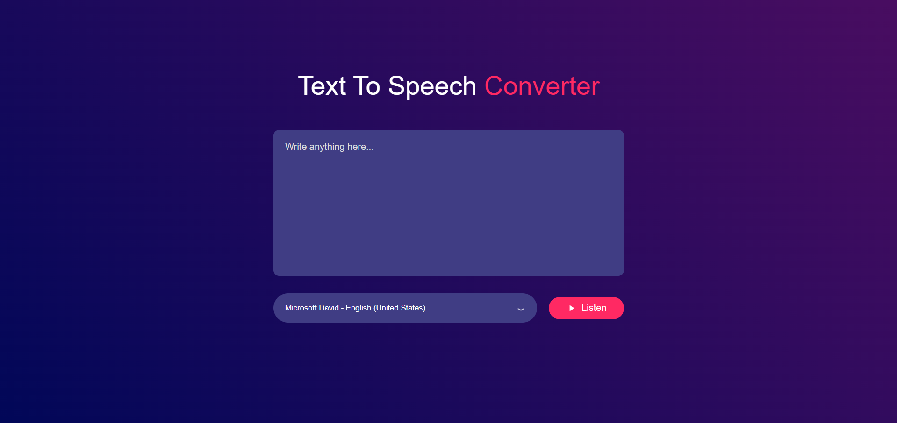

# Text To Voice Converter

A simple Text to Voice Converter web application using HTML, CSS, and JavaScript.

## Features

- Converts text input into voice.
- Supports multiple voices.
- Easy to use interface.

## Screenshots

## Prerequisites

To run this project, you only need a modern web browser.

## Usage

1. Open the application in your web browser.
2. Enter the text you want to convert to voice in the text area.
3. Select the desired language and voice.
4. Click the "Listen" button to hear the text.
